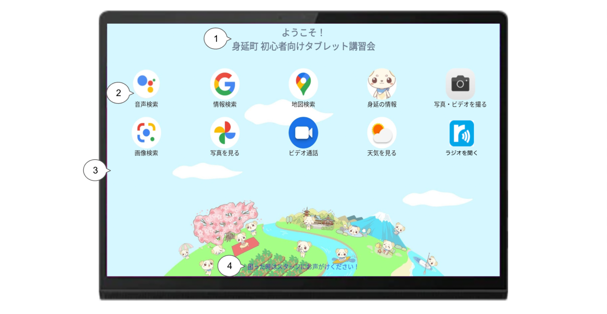
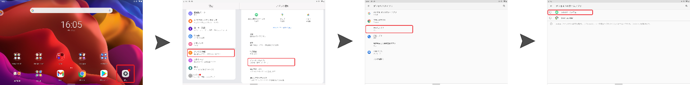
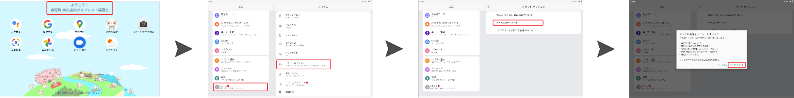
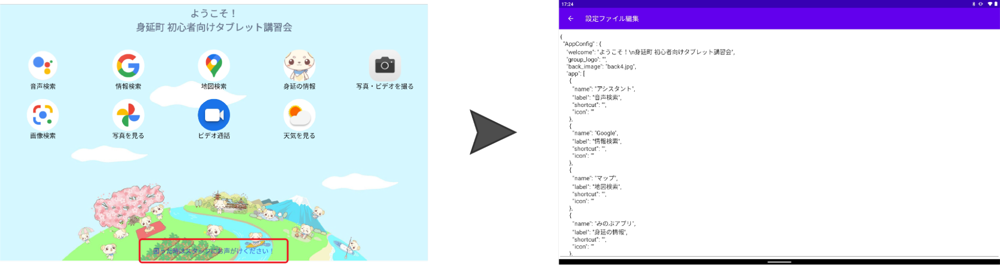

<br>

# __みのぶホームメニューへようこそ！__  

<br>

みのぶホームメニューは __「誰一人取り残さない、人に優しいデジタル地域社会」__ の実現を目指して、  
 __山梨県身延町__ で開催される __「高齢者の方に向けた講習会」__ のために開発された __Android用ランチャーアプリケーション__ です。  
本アプリでカスタムを行うことで、 __タブレットが初めての方__ でも、体験を通して __楽しみながら学ぶことができるホーム画面__ の実現が可能です。  
<br>
### __目次__  
### __1.画面説明__  
### __2.デフォルトホーム設定__   
　 2-1.デフォルトホーム設定手順  
　 2-2.デフォルトホーム解除手順  
### __3.設定ファイル操作__  
　 3-1.設定ファイル導入  
　 3-2.設定ファイルエディタ起動  
　 3-3.ウェルカムメッセージ変更  
　 3-4.背景画像変更  
　 3-5.アプリ変更  
　 3-6.ヘルプメッセージ変更  
　 3-7.編集にエラーがあった場合  
### __4.動作環境について__  

<br>
<br>

## 1.画面説明


### 1.ウェルカムメッセージ  
　講習会参加者へ向けた歓迎のメッセージ。テキストは設定ファイルから変更可能。  
　また、「設定」アプリを表示していなくても本メッセージから設定アプリを起動することが可能。  
 （手順は後述）  

### 2.アプリ  
　講習会で使用するアプリ。設定ファイルからアプリとその表示名を変更可能。  
　表示可能数は最大10個まで。  

### 3.背景画像  
　設定ファイルから変更可能。  

### 4.ヘルプメッセージ
　講習会参加者へ向けた諸注意などが記載できる一言メッセージ。  
　テキストは設定ファイルから変更可能。  
　また、本メッセージから設定エディタを起動することが可能。  
　（手順は後述）

<br>
<br>

## 2.デフォルトホーム設定

### 2-1.デフォルトホーム設定手順



 - Android端末の __「設定」__ アプリを起動します。
 -  __「アプリと通知」__ を選択します。
 - 「アプリと通知」メニューから __「デフォルトのアプリ」__ を選択します。
 - 「デフォルトのアプリ」メニューから __「ホームアプリ」__ を選択します。
 - 表示された対象のホームアプリの中から __「みのぶホームメニュー」__ を選択します。
 -  __ホーム画面に戻る__ と、みのぶホームメニューがデフォルトホームとして表示されます。  
電源を切った後も、引き続きホーム画面はみのぶホームメニューになります。

<br>

### 2-2.デフォルトホーム解除手順


 - 画面上部にある __ウェルカムメッセージ__ を連続で __7回タップ__ します。
 -  __「設定」__ アプリが起動します。
 -  __「システム」__ を選択します。
 - 「システム」メニューから __「リセットオプション」__ を選択します。
 - 「リセットオプション」メニューから __「アプリの設定をリセット」__ を選択します。
 - 表示されたダイアログ内にある __「アプリをリセット」__ をタップします。
 -  __ホーム画面に戻る___ と、ホームアプリの設定が解除され、Androidデフォルトホームに戻ります。  
電源を切った後も、引き続きホーム画面はAndroidデフォルトホームになります。  

###### 　　※ この操作はデフォルトホーム以外の設定もリセットされる可能性があります。この操作を行う際は、
###### 　　　 端末の各種設定をご確認の上、自己責任で実行してください。当方はこの操作による一切の責任を負いかねます。  
###### 　　※ 連続でタップしている途中で、他の操作を行なった場合タップ回数はリセットされます。  

<br>
<br>

## 3.設定ファイル操作

### 3-1.設定ファイル導入
- 本オープンソース内の __「custom.json」__ ファイルを  
Android端末内 __「内部共有ストレージ」>「Android」>「data」>「org.ycc.customlancher」>「files」>「Documents」__ 下に保存します。

###### 　　※ 本操作を行う際は、AndroidOS側のセキュリティに伴い、WindowsPCに「custom.json」を保存し、
###### 　　　 Android端末を接続の上「Documents」フォルダに「custom.json」を保存することを推奨します。  
###### 　　※ WindowsPCからAndroid端末への「custom.json」ファイルの保存ができない、PCがAndroid端末を認識しない場合は、
###### 　　　 Android端末側の「デベロッパーモード」「USBデバッグ」「ファイル転送」などがONになっているかご確認の上、再度お試しください。  

<br>

### 3-2.設定ファイルエディタ起動


- 画面下部にある __ヘルプメッセージ__ を連続で __7回タップ__ します。
###### 　　※ 連続でタップしている途中で、他の操作を行なった場合タップ回数はリセットされます。

<br>

### 3-3.ウェルカムメッセージ設定
```
   "AppConfig": {
    "welcome": "こんにちわ！\n身延町 初心者向けタブレット講習会",
    "group_logo": "",
    "back_image": "back4",
```    
 - 設定ファイルエディタを起動し、ソース内の上記箇所を編集します。
 -  __「"welcome"："XXX",」__ の「XXX」部分に、設定したいテキストを入力します。途中で改行する場合は「\n」を入力します。
 - 画面左上の __戻る__ ボタンをタップします。
 - 表示されたダイアログ内にある __「YES」__ をタップでエディタの変更が保存されます。
 - みのぶホームメニューを __再起動__ すると、変更が反映されます。

<br>

### 3-4.背景画像設定
```
   "AppConfig": {
    "welcome": "こんにちわ！\n身延町 初心者向けタブレット講習会",
    "group_logo": "",
    "back_image": "back4",
```    
 - 事前に、Android端末内 __「内部ストレージ」 > 「Android」 > 「data」 > 「org.ycc.customlancher」 > 「files」 > 「Pictures」__ 下に、  
 背景に設定したい __縦画面用画像、横画面用画像のファイル__ をそれぞれ保存します。  
 また、 __横画面用画像のファイル名__ は **「XXX（縦画面用画像と同じファイル名）_l」** に変更します。  
 - 設定ファイルエディタを起動し、ソース内の上記箇所を編集します。  
 -  __「"back_image"："XXX",」__ の「XXX」部分に、背景に設定したい __縦画面用画像のファイル名__ を入力します。
 - 画面左上の __戻る__ ボタンをタップします。
 - 表示されたダイアログ内にある __「YES」__ をタップでエディタの変更が保存されます。
 - みのぶホームメニューを __再起動__ すると、変更が反映されます。

<br>

### 3-5.アプリ設定
```
   "app": [
      {
        "name": "アシスタント",
        "label": "音声検索",
        "shortcut": "",
        "icon": ""
```        
 - 設定ファイルエディタを起動し、ソース内の上記箇所を編集します。
 -  __表示するアプリ__ を変更する場合は、 __「"name"："XXX",」__ の「XXX」部分に、表示させたいアプリの __Androidホーム画面で表示されている  
 アプリ名__ を入力します。  （例：Googleアシスタント→「アシスタント」と入力。）
 - 画面上で表示する __アプリ名称__ を変更する場合は、 __「"label"："XXX",」__ の「XXX」部分に、任意の __変更したいアプリ名__ を入力します。
 - 画面左上の __戻る__ ボタンをタップします。
 - 表示されたダイアログ内にある __「YES」__ をタップでエディタの変更が保存されます。
 - みのぶホームメニューを __再起動__ すると、変更が反映されます。

###### 　　※ソース内に上記箇所は8箇所あり、ホーム画面上段左から１〜４、下段左から５〜８つ目に対応しています。
###### 　　 　なお、アプリの表示数は最大８種までとなっており、入力のない箇所にはアプリは表示されません。  
###### 　　※「"shortcut"："XXX",」「"icon"："XXX",」は現在対応箇所はありません。  

<br>

### 3-6.ヘルプメッセージ設定
```
    "help_1": "困った時はスタッフまでどうぞ",
    "help_2": "困った時はスタッフにお声がけください！",
    "help_3": "困った時はスタッフにお声がけください！",
    "help_4": "困った時はスタッフにお声がけください！",
    "help_5": "困った時はスタッフにお声がけください！"    
```
 - 設定ファイルエディタを起動し、ソース内の上記箇所を編集します。
 -  __「"help_1"："XXX",」__ の「XXX」部分に、設定したいテキストを入力します。
 - 画面左上の __戻る__ ボタンをタップします。
 - 表示されたダイアログ内にある __「YES」__ をタップでエディタの変更が保存されます。
 - みのぶホームメニューを __再起動__ すると、変更が反映されます。

###### 　　※「"help_2"："XXX",」〜「"help_5"："XXX",」は現在対応箇所はありません。  

<br>

### 3-7.編集にエラーがあった場合
 - 設定ファイル編集後にエラーがあった場合、ホームに戻るときエラーダイアログが表示され強制的に編集前の状態に戻ります。

<br>
<br>

## 4.動作環境
本アプリは以下環境において開発及び動作確認を行いました。  
OS：Android11  
機種：Lenovo Yoga Tab 11  

###### 　※上記以外のAndroid OS及び機種での動作は保証致しません。予めご了承ください。
###### 　※上記と同じ環境下においても端末の設定などによっては正常に動作しない場合がございます。

<br>
